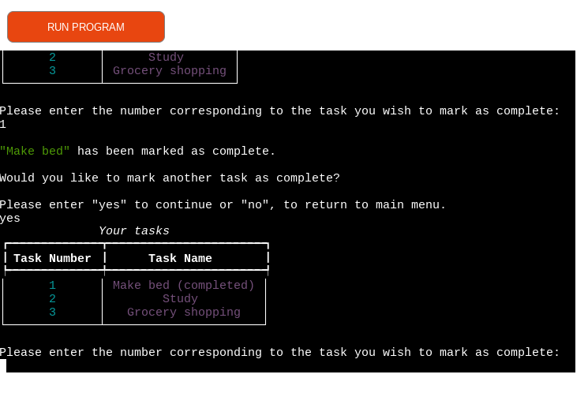
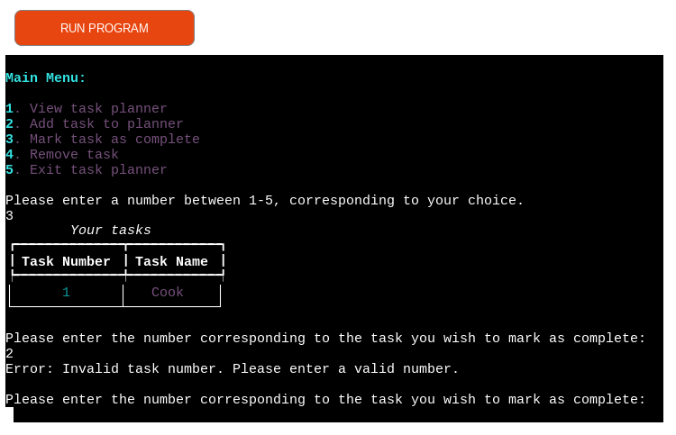

# Task planner

## Purpose
The task planner application is designed to provide users with an easy-to-use, interactive experience within the terminal. Its primary objective is to enable users to effortlessly create a list of tasks, mark them as complete, or remove them as needed.

The application is built using Python. [The live deployed application can be viewed on Heroku here](https://task-planner-116ed91c8a59.herokuapp.com/).

## Features

The functions and features of the application were planned out using a flow-chart before the code was written to implement the desired features:

### Existing Features

#### Menu
The app features a main menu that is displayed through the show_menu() function. The main menu contains colour formatting to provide the user with a visually appealing experience, and to indicate when the user has returned to the main menu following interactions with their task planner.

The menu contains five options which facilitate navigation and interaction within the app. It uses user input in the form of integers to seamlessly call the corresponding functions for each menu item, ensuring a user-friendly and intuitive user experience.

#### Task Display

Within the main menu, the first option available to the user is to view the tasks in the task planner, using the integer 1. The function view_tasks(tasks) is subsequently called. 

Upon selecting this option, the user will either be presented with a table of numbered tasks they have added, or, in the absence of any tasks, they will be prompted to add tasks or return to the main menu.

#### Task Addition

The second menu option presented to the user is to add a task to their list, which, using the user input of 2 as an integer, calls the add_tasks(tasks) function. 

If tasks have already been added by the user, a table of these tasks will be created and displayed, before the user is prompted to enter a new task. Once the user has done so, they then have the option of either adding further tasks or to return to the main menu.

#### Task Completion
The third menu option provided to the user involves marking a task on their list as complete. By inputting the integer 3, the user triggers the complete_tasks(tasks) function.

This function first checks whether all tasks are complete and then whether there have been any tasks added. If there are tasks available which have not yet been marked as complete, the user will be asked to select which task they would like to add the (completed) label to, using corresponding integers.

The user will be able to mark all remaing incomplete tasks, as complete, if they wish to do so. Once they have done so, they will be redirected back to the main menu.

#### Task Removal

The fourth menu option presented to the user is the ability to remove a task from their list. By entering the integer, the user triggers the calling of the remove_tasks(tasks) function. 

The user is again provided with a table of existing tasks, and can numerically select which task to remove from the list. This can be repeated until the list is empty, and the user will return to the main menu.

#### Exiting the application

The fifth and final menu option available to the user is to exit the application, which is triggered by the user input of 5 as an integer. This action calls the leave_planner function.

The user is asked to confirm their choice with "yes" or "no" strings. The former string will present them with a farewell message and discontinue interaction with the app, and the latter will bring them back to the main menu.

#### Exception handling
Exception handling exists throughout the various functions and features within the application in order to gracefully handle unexpected errors or input, and provide the user with informative error messages. Some examples of exception handling in this project include:

Invalid Menu Choices:

Within the menu option selection, the user is prompted to input a number within the range of 1-5, corresponding to the menu item of their choice. The code then checks whether a valid integer within this range has been provided. If an invalid response has been received, a ValueError is raised and the user is requested to enter a valid answer.

- Yes/No Input Validation:

Throughout the application, such as in functions like no_tasks(), add_task(), and leave_or_stay(), the user is asked to confirm specific actions using "yes"/"no" responses. To accommodate variations in capitalization, the user's responses are converted to lowercase. If invalid input is received, a ValueError is raised and the user is prompted to re-enter their response.

- Numeric Input Handling:

Where a user is requested to provide a string input but enters an integer, a Value Error is raised with an informative message advising the user the requested input should not include any numeric values.

- Task Number Validation:

In the functions complete_tasks(tasks) and remove_tasks(tasks) the user's input is checked to ensure an integer within the range of tasks available has been entered, and if not a Value Error is raised with an informative message.

#### Formatting with Rich Library

The rich library has been installed within this project, in order to provide the user with an enhanced and more visually appealing experience. 

The table class has been implemented to display the tasks list in an aesthetically pleasing and structured format, and the main menu has been styled distinctively in magenta and cyan colours. This formatting highlights to the user when they have returned to the main menu and can make further choices within their task planner, improving readability and organisation.

### Future Features

#### Data storage

In future versions of this application, I would like to offer the user the flexibility of connecting their task planner with either a database, or creating a Google Sheet for efficient storage.

#### Calendar Integration

Another potential feature for future versions would involve enabling users to create to-do lists within the task planner for specific dates. Storing this information in a database or Google Sheet would allow users to conveniently select and act upon lists associated with different dates.

## Data Model

Fundamental to the task planner is the global `tasks` list, a central data structure that plays a crucial role in the organisation and management of tasks throughout the project. Each main function within the task planner interacts with this list, allowing users to view, add, complete, and remove tasks through its use as a parameter. This data structure is used in the following functions:

- create_table(tasks):

Creates a table using the `tasks` list as a parameter, generating rows corresponding to the length of the tasks list.

- view_tasks(tasks): 

Using the `tasks` list as a parameter, the user can view the tasks that have been added to the tasks list.

- add_task(tasks): 

Enables users to append a task item to the `tasks` list.

- all_tasks_complete(tasks):

The `tasks` list is checked for all tasks which contain (Completed) within their string.

- complete_task(tasks):

A task at a specified index within the `tasks` list is replaced with a string to include (Completed), effectively marking the task in the list as complete.

- remove_task(tasks):

A task at a specified index within the `tasks` list can be removed by the user.

## Testing

I have manually tested the project throughout by doing the following:
- Using a pep8 linter to confirm there are no issues.
- Tested the project throughout it's development in my own terminal, and then in the deployed project terminal on Heroku.

The below tables illustrate the results of my feature testing.

### Menu display
| Testing scenario           | Input                            | Expected Result                                              |
| ------------------ | -------------------------------- | ------------------------------------------------------------ |
| Valid Input        | Enter an integer within the range of 1-5. | The corresponding function is called, and the task planner operates as expected. |
| Invalid Input (Out of Range) | Enter an integer outside the range of 1-5. | An error message is displayed, advising the user their input was invalid and the menu is displayed again |
| Invalid Input (Non-Integer) | Enter a string, space or a special character. | An error message is displayed, prompting the user to enter a numeric value between 1-5. |

### Task Display
| Testing scenario           | Input                            | Expected Result                                              |
| ------------------ | -------------------------------- | ------------------------------------------------------------ |
| No Tasks Added | Enter yes or no, to question of whether you would you like to add a task | Error message is displayed if anything other than the strings "yes" or "no" are entered. With "yes", add_tasks(tasks) function is called, with "no" show_menu() function is called, operating as expected. |
| Tasks Added | Enter "return" or "leave", to question of whether you would like to return to main menu or leave planner| create_table(tasks) function is called to display tasks list. If invalid input received, an error message is displayed, advising the user their input was invalid and they are prompted to respond again. Otherwise, leave_or_stay() function is called and operates as expected. |

### Task Addition
| Testing scenario           | Input                            | Expected Result                                              |
| ------------------ | -------------------------------- | ------------------------------------------------------------ |
|Task Addition - Second Main Menu Option | User can enter a task using any combination of strings, integers etc with no limitations. | The task is appended to the global tasks list as expected, and can be viewed when the view_tasks(tasks) function is called, or when adding another task, as expected. |
|Task Addition - First Main Menu Option - Invalid Input | Enter "yes" or "no", to question of whether user would you like to add a task.| An error message is displayed, advising the user their input was invalid choice and the question is displayed again.|
|Task Addition - First Main Menu Option - Valid Input | Enter "yes" or "no", to question of whether user would you like to add a task.| add_task(tasks) function is called and user can enter a task using any combination of strings, integers etc with no limitations, and input is appended to tasks list, operating as expected. |

### Task Completion
|Testing Scenario                        | Input                                  | Expected Result                                              |
| ------------------------------- | -------------------------------------- | ------------------------------------------------------------ |
| Mark Task as Complete | Enter the number corresponding to a task in the list, to mark as complete. | The selected task is marked as complete, and the user receives confirmation. |
| Mark Another Task as Complete | Enter "yes" or "no", to question of whether you would you like to complete another task | With "yes" user is prompted to select another task in the list to mark as complete. With "no" user is returned to main menu. |
| Attempt to Mark Already Completed Task | Enter the number corresponding to a task that is already marked as complete. | An informative message is displayed, indicating that the task is already marked as complete, and asks user if they wish to mark another task as complete or not. |
| Invalid Input (Non-Numeric) | Enter a non-numeric value when prompted. | An error message is displayed, guiding the user to enter a numeric value corresponding to a task. |
| Invalid Task Number | Enter a task number that exceeds the range of tasks in the tasks list. | An error message is displayed, instructing the user to enter a valid task number. |

### Task Removal

|Testing Scenario                        | Input                                  | Expected Result                                              |
| ------------------------------- | -------------------------------------- | ------------------------------------------------------------ |
| Remove Task | Enter the number corresponding to a task, to remove. | The selected task is removed from the task list, and the user receives confirmation. |
| Remove Another Task | Enter yes or no, to question of whether you would you like to remove another task | With "yes" user is prompted to select another task in the list to remove. With "no" user is returned to main menu. |
| Removal Attempt of Non-Existent Task | Enter a task number that does not exist. | An error message is displayed, informing the user that the task number is invalid, and prompts them to enter a valid number. |
| Invalid Input (Non-Numeric) | Enter a non-numeric value when prompted. | An error message is displayed, advising the user to enter a numeric value corresponding to a task. |

### Exiting the application
| Testing scenario           | Input                            | Expected Result                                              |
| ------------------ | -------------------------------- | ------------------------------------------------------------ |
| leave_planner() - Valid Input | Enter string of "yes" or "no". | With "yes" the exit() function is called, ending the user's interacting with the task planner. With "no" the user is brought back to the main menu. The function therefore operates as expected. |
|leave_planner() Invalid Input | Enter a special character, space, integer within a string or alone | An error message is displayed, advising the user their input was invalid choice and the prompt is displayed again. |
| leave_or_stay() - Valid Input | Enter string of "return" or "leave" | When this function is called, an input of "return" calls the show_menu() function, bringing the user back to the main menu. An input of "leave" prints a goodbye message and calls the exit() function, ending the user's interacting with the task planner. The function therefore operates as expected.|
| leave_or_stay() - Invalid Input (Non-Integer) | Enter a string apart from "return" or "leave", a space, numeric value(s) or special character(s). | An error message is displayed, prompting the user to enter a string of "return" or "leave". |

### Bugs

#### Solved bugs
- Completed tasks:

Within the complete_tasks(tasks) function, where a user selected to mark a particular task as completed, a user could potentially mark a task as completed multiple times. This was resolved by adding a check for whether the task already contained "(Completed)" before proceeding with the logic.

- Index errors:

Initially when writing my code for the complete_tasks(tasks) function, I was getting errors for example when inputting the integer 1 to select the first task, when there was only item in my list, as the list was displayed starting from 1 rather than 0 as in the list indexing. I solved this by deducting 1 from completed_task_number. I then applied the same resolution to my remove_tasks(tasks) function.

- Exception handling:

Within the show_menu() function, initially if a user entered a space or a special character, the terminal would print a generic non-user friendly error message, which did not provide specific information on the error the user had made. The show_menu() function was therefore updated to first raise a value error if the user input was not a digit, before converting the input to an integer.

#### Remaining bugs

There are no bugs remaining in the project.

### Validator Testing

The code was run through a [PEP8 linter](https://pep8ci.herokuapp.com/) and initally flagged a number of issues due to the comments surpassing the width of the terminal and some trailing whitespace. The code was updated and subsequently passed with no issues.

## Deployment

This project was deployed using Heroku. The steps taken for deployment are:

- Log in to [Heroku](https://dashboard.heroku.com/apps).
- Select Create new app, provide your app with a unique name and select your region. Then click `Create app`.
- On the next page, navigate to `Settings` in the menu bar, and within `Config Vars` add PORT as the key and 8000 as the value.
- Within `Buildpacks`, add the buildpacks Python and NodeJS, in this order.
- Navigate to `Deploy` in the menu bar.
- Connect Github under `Deployment Method` and provide the link to the repository.
- Within `Manual Deploy` select `Main` and then `Deploy Branch`. Once the branch has been built you can view your deployed project.

## Credits

### Code
- Inspiration for styling using rich library aquired and adopted from [Rich]:(https://rich.readthedocs.io/en/stable/style.html)
- Learned about creating tables and used code snippets from [Rich](https://rich.readthedocs.io/en/stable/tables.html).
- Idea for enumeration found on [Stack Overflow](https://stackoverflow.com/questions/73923829/how-to-accept-input-from-an-enumerated-list-in-python) and method learned and modified from [Real Python]([)](https://realpython.com/python-enumerate/)
- Idea for input validation in menu function taken from here: https://stackoverflow.com/questions/16335771/shorter-way-to-check-if-a-string-is-not-isdigit

## Acknowledgements
I would like to once again thank my mentor Ronan McClelland for being so supportive, for his invaluable assistance and inspiration throughout this project.